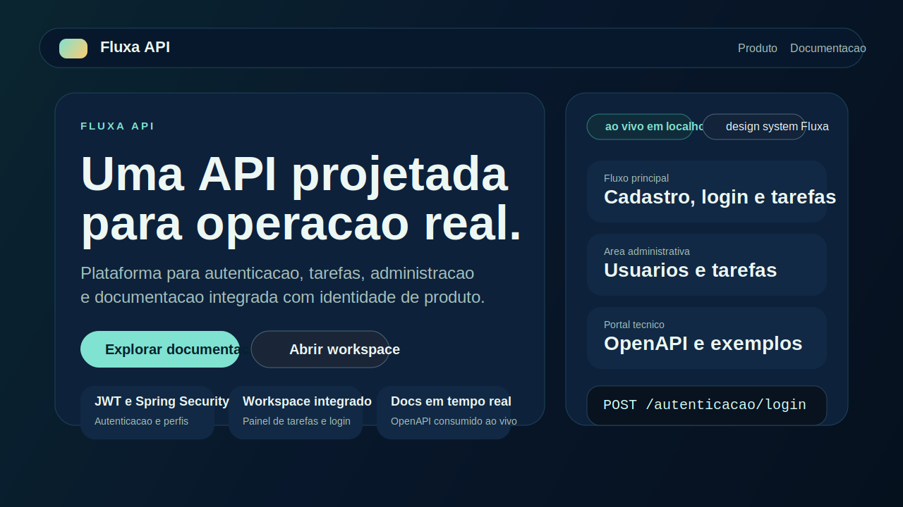
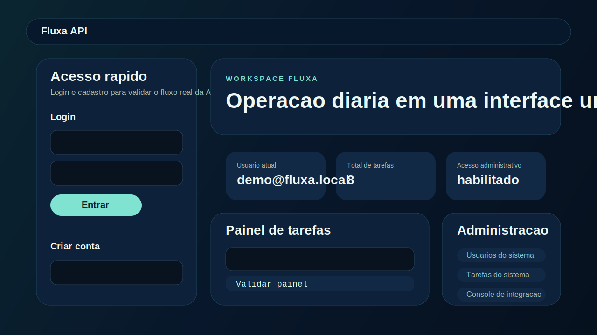
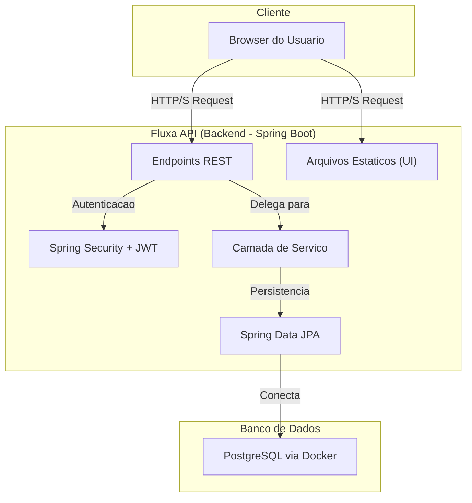

# Fluxa API v2-BR


A **Fluxa API v2-BR** e uma plataforma para gestao de tarefas e usuarios com identidade totalmente abrasileirada.
Ela une **API REST**, **autenticacao JWT**, **workspace web**, **documentacao integrada** e **persistencia em PostgreSQL**
em uma experiencia pensada para demonstracao, onboarding tecnico e operacao local com acabamento de produto.

## Visao do produto

A versao v2-BR reposiciona a Fluxa como uma plataforma mais completa do que uma API isolada. O backend continua sendo o
centro da operacao, mas agora a aplicacao tambem oferece uma interface web embutida para apresentar o produto,
documentar a API, operar tarefas e visualizar dados administrativos no mesmo ambiente.

Principais evolucoes da v2-BR:

- branding e linguagem de dominio em portugues
- pagina inicial institucional em `/`
- portal de documentacao consumindo o OpenAPI da propria aplicacao
- painel web simples para tarefas
- painel administrativo para usuarios e tarefas
- Swagger/OpenAPI alinhado com a identidade Fluxa

## Demonstracao

- **Ambiente Online:** *Em breve!* Um ambiente de demonstracao estara disponivel para voce testar a plataforma sem precisar instalar nada.
- **Execucao Local:** Siga os passos na secao "Como executar localmente" para ter sua propria instancia da Fluxa API rodando em minutos.

## Roadmap

- [ ] Testes unitarios e de integracao para garantir a qualidade do codigo.
- [ ] Pipeline de CI/CD com GitHub Actions para automacao de builds e deploys.
- [ ] Funcionalidades de colaboracao em tarefas (compartilhamento, comentarios).
- [ ] Notificacoes por e-mail sobre atividades importantes.

## Capturas da interface

### Pagina inicial do produto



### Workspace com tarefas e administracao



## Principais recursos

- Autenticacao e autorizacao com JWT em fluxo stateless
- Perfis de acesso `USUARIO` e `ADMINISTRADOR`
- CRUD de tarefas do usuario autenticado
- Isolamento de dados por usuario
- Interface web para login, cadastro e operacao diaria
- Portal de documentacao com leitura em tempo real do OpenAPI
- Respostas de erro padronizadas em portugues
- Diagnostico rapido de porta para conflitos locais

## Enderecos da aplicacao

Com a aplicacao em execucao:

- Interface da Fluxa: `http://localhost:8080/`
- Swagger UI: `http://localhost:8080/swagger-ui.html`
- OpenAPI JSON: `http://localhost:8080/v3/api-docs`

## Arquitetura



## Stack utilizada

- Java 17
- Spring Boot Web
- Spring Data JPA
- Spring Security
- Bean Validation
- PostgreSQL
- SpringDoc OpenAPI
- Flyway
- Lombok
- Docker Compose

## Rotas principais da API

### Autenticacao

- `POST /autenticacao/cadastro`
- `POST /autenticacao/login`

### Tarefas

- `GET /tarefas`
- `POST /tarefas`
- `GET /tarefas/{id}`
- `PUT /tarefas/{id}`
- `DELETE /tarefas/{id}`

### Usuario autenticado

- `GET /usuarios/eu`

### Administracao

- `GET /administracao/usuarios?page=0&size=20&termo=ana&perfil=USUARIO`
- `GET /administracao/tarefas?page=0&size=20&status=CONCLUIDA&emailUsuario=ana@fluxa.com`

## Exemplos de payload

### Cadastro de usuario

```json
{
  "nome": "Maria Silva",
  "email": "maria@fluxa.com",
  "senha": "123456"
}
```

### Login

```json
{
  "email": "maria@fluxa.com",
  "senha": "123456"
}
```

### Criacao de tarefa

```json
{
  "titulo": "Preparar apresentacao",
  "descricao": "Finalizar a apresentacao do status do projeto"
}
```

### Resposta padrao de erro

```json
{
  "erro": "validacao",
  "mensagem": "O titulo e obrigatorio.",
  "status": 400,
  "caminho": "/tarefas",
  "timestamp": "2026-03-25T15:30:00Z"
}
```

### Resposta de cadastro

```json
{
  "mensagem": "Usuario cadastrado com sucesso."
}
```

### Resposta de usuario autenticado

```json
{
  "id": 1,
  "nome": "Maria Silva",
  "email": "maria@fluxa.com",
  "perfil": "USUARIO"
}
```

### Resposta paginada de administracao

```json
{
  "content": [
    {
      "email": "ana@fluxa.com"
    }
  ],
  "page": {
    "size": 20,
    "number": 0
  },
  "totalElements": 1,
  "totalPages": 1
}
```

## Como executar localmente

### Pre-requisitos

- Java 17+
- Maven
- Docker e Docker Compose

### 1. Suba o banco de dados

```bash
docker compose up -d
```

### 2. Execute a aplicacao

Variaveis opcionais de ambiente:

- `DB_URL`
- `DB_USERNAME`
- `DB_PASSWORD`
- `DB_POOL_SIZE`
- `DB_MIN_IDLE`
- `JWT_SECRET`
- `JWT_EXPIRATION_MS`

Profiles disponiveis:

- `dev`: perfil padrao para desenvolvimento local, com Swagger habilitado
- `prod`: exige secrets via ambiente e desabilita Swagger/OpenAPI publico
- `test`: usado pela suite automatizada com H2 em memoria

No Windows PowerShell:

```powershell
.\mvnw spring-boot:run
```

No macOS ou Linux:

```bash
./mvnw spring-boot:run
```

### 3. Acesse a plataforma

- `http://localhost:8080/`
- `http://localhost:8080/swagger-ui.html`

## Fluxo recomendado de uso

1. Acesse a interface da Fluxa em `/`
2. Crie um usuario pelo painel ou pelo endpoint de cadastro
3. Faca login para obter o token
4. Crie e consulte tarefas no workspace
5. Use o Swagger para testes tecnicos mais detalhados
6. Se tiver um usuario com perfil administrativo, acesse o painel de administracao

## Diagnostico de porta

Se a `8080` ja estiver em uso:

```powershell
powershell -ExecutionPolicy Bypass -File .\scripts\inspecionar-porta.ps1
```

Para inspecionar outra porta:

```powershell
powershell -ExecutionPolicy Bypass -File .\scripts\inspecionar-porta.ps1 -Porta 8081
```

## Observacoes

- O painel administrativo depende de um token com perfil `ADMINISTRADOR`
- O cadastro publico cria usuarios comuns
- O schema do banco agora e controlado por migrations em `src/main/resources/db/migration`
- A interface web e servida diretamente por `src/main/resources/static`
- O Swagger continua disponivel para exploracao tecnica da API

Desenvolvido por **Jackson De lima**
